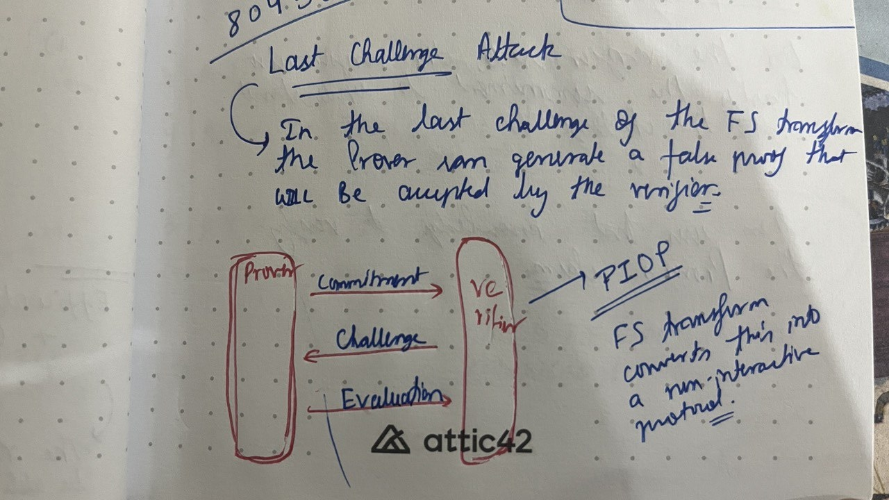

# ZK Notes

## Fiat Shamir Transform

The Fiat Shamir transform is something that we often come across when studying how different ZK protocols work and it seems like everyone just assumes that you already know what FS transform is, lol.

Here is an explanation of what the Fiat Shamir transform means.

+ Any proving system typically consists of some back and forth messaging between the prover and the verifier to judge whether the proof presented by the prover is true or not. Since that is not ideal in different protocols, Fiat Shamir proposes a mechanism to convert interactive protocols into non-interactive protocols.

+ When you want to assess whether the Fiat Shamir transform is mathematically (crpytographically) secure or not, you ensure the three following properties hold: 
    + Completeness
        + All correct proofs are always accepted
    + Soundness
        + All incorrect proofs are always rejected (a very small probability of false claims being accepted is fine, also known as *negligible soundess*)
    + Preserving ZK (over n rounds)
        + Even after getting the answers from the prover for different challenges for `n` rounds, the verifier does not gain computational power. That is, **What the verifier can compute after the interaction == What the verifier could have computed before the interaction**

+ Long form Resource: Watch this [presentation by @ronrothblum](https://youtube.com/watch?v=9cagVtYstyY)

+ This presentation will help you understand why FS is secure for an ideal hash function, ie, the ROM (Random Oracle Model).

+ And most importantly, why people make mistakes while implementing FS, because FS does not have such strong guarentees over real, concrete hash families. And, if you can internalise why, I reckon that would be a good spot to go bug-hunting.

+ Example of a bug due to incorrect implementation of Fiat Shamir over the PLONK proving system: [Last Challenge Attack by OZ](https://www.youtube.com/watch?v=Sk-S8-n6Jo4)
    + Quick Recap
    + 
    + PIOP -> Polynomial Interactive Oracle Protocol