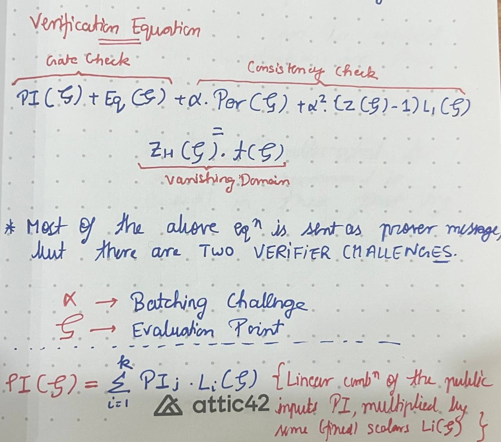

# Safu ZK: Handbook for ZKP Security

## Fiat Shamir Transform

The Fiat Shamir transform is something that we often come across when studying how different ZK protocols work and it seems like everyone just assumes that you already know what FS transform is, lol.

Here is an explanation of what the Fiat Shamir transform means.

1. Any proving system typically consists of some back and forth messaging between the prover and the verifier to judge whether the proof presented by the prover is true or not. Since that is not ideal in different protocols, Fiat Shamir proposes a mechanism to convert interactive protocols into non-interactive protocols.

2. When you want to assess whether the Fiat Shamir transform is mathematically (crpytographically) secure or not, you ensure the three following properties hold: 
    + Completeness
        + All correct proofs are always accepted
    + Soundness
        + All incorrect proofs are always rejected (a very small probability of false claims being accepted is fine, also known as *negligible soundess*)
    + Preserving ZK (over n rounds)
        + Even after getting the answers from the prover for different challenges for `n` rounds, the verifier does not gain computational power. That is, **What the verifier can compute after the interaction == What the verifier could have computed before the interaction**

3. Long form Resource: Watch this [presentation by @ronrothblum](https://youtube.com/watch?v=9cagVtYstyY)

4. This presentation will help you understand why FS is secure for an ideal hash function, ie, the ROM (Random Oracle Model).

5. And most importantly, why people make mistakes while implementing FS, because FS does not have such strong guarentees over real, concrete hash families. And, if you can internalise why, I reckon that would be a good spot to go bug-hunting.

### FS Security B1: Last Challenge Attack

1. Example of a bug due to incorrect implementation of Fiat Shamir over the PLONK proving system: [Last Challenge Attack by OZ](https://www.youtube.com/watch?v=Sk-S8-n6Jo4)
    + Quick Recap of the how the hack is carried out
    + 
    + PIOP -> Polynomial Interactive Oracle Protocol
    + What changes to the above diagram when we implement the FS transform?
    + Well, first the prover commits to the polynomial as expected
    + Then, he *hashes the commitment to the polynomial to create the challenge* (the challenge would have originated from the Verifier in an interactive setting)
    + Then using the generated challenge, prover evaluates the polynomial and sends the evaluation to the verifier together with the proof.
    + On the verifier side the verifier also hashes the commitment to understand the challenge and then uses that knowledge to verify prover's claims.
    + The PLONK prover goes in 5 rounds (of back and forth) and I'll shortly present the table of what happens in all those rounds. Let's first understand what each column is:
        + Transcript: answers given by the prover + initial Poly commitment
        + Out FS Challenge: Challenge given to the prover
        + FS Challenge: I/P to the current round from the previous rounds
    + 
    + Now, the final proof π is generated from the transcript that were produced upto this point. It looks something like this:
    + 
    + Important point to note is that `u` (or the last challenge) is not being used anywhere in the calculation of the proof. Therefore, *it makes sense to replace hashing all the transcripts to obtain `u` with a random value.*

2. Now onto the last step of the PLONK verifier. If the following equation holds, then the proof is accepted.
    + 
    
3. Now these are the steps that the attacker would take to forge a false proof that would be accepted by the verifier.
    + **Bootstrapping**: Prover produces `A` and `B` from any circuit of its choice. By virtue of it being a legitimate proof, the equation highlighted in 7 holds.
    + The prover can change any values in the proof π highlighted in green (including the public inputs) apart from the polynomial commitments, red blocks:
        + 
    + Prover computes `F` and `E` from the fixed components in π using steps 9-11 of the verifier
    + Now, the Prover goes onto calculate these two red variables by exploiting the independence of `u` on the two red elements.
        +  
    + Prover adds the missing X and Y to complete the false proof π
    + Verifier accepts the false proof π as valid, because we started off with a valid proof. What we did is simply retrofitted the two values.

4. That's it. That was the exploit. Key Takeaways: 
    + FS challenges must depend on the entire transcripts
    + PLEASE follow the protocol

### FS Security B2: Weak Fiat Shamir Attacks

1. As mentioned in the Fiat Shamir description earlier, whether a FS implementation is secure or not is dependent on whether *soundness* and *completeness* is preserved or not (ZK too, but that's not the focus right now).

2. It is shown in the academic papers that the Fiat Shamir transform preserves these security properties. But that is true for **non-adaptive** settings, ie, settings where the malicious prover P* may not choose the statements.

3. In adaptive settings, P* can compute both `π` and `x` simultaneously.
    + `π` -> Proof
    + `x` -> Public Statement

4. These notions of adaptive and non-adaptive settings give rise to the notion of **WEAK FIAT SHAMIR** and **STRONG FIAT SHAMIR** implementation. 
    + Since calculating both `π` and `x` is only possible if we omit the public statement in the calculation of the challenges and hence the proof `π`, that is referred to as the *weak* implementation of Fiat Shamir.
    + On the other hand, if we want to stop the prover P (malicious or not) from calculating both `π` and `x` simultaneously we have to make sure that these values cannot be calculated independently. Hence, using the public statement `x` to generate the challenges and hence the proof `π` is called the *strong* implementation of Fiat Shamir.

5. The above points can be summarised by this picture:
    +  

6. Now to understand how weak FS implemetations affect PLONK proofs, we first go over the very basics of PLONK on a high level:
    + PLONK has a constraint system that deals with addition, multiplication (and custom) gates
    + This looks something like this:
    + 
    + We need two types of constraints for this system:
        + Gate Constraints for Gate correctness
        + Consistency Constraints for wiring correctness
    + Now, the ultimate **verification equation** that must be satisfied for it to be a valid proof looks something like this:
    + 
    + Please take a note of the equation as well description of the various parts of it from the above photo

7. With an understanding of PLONK and weak FS, let's see how a typical attack would be carried out in this scenario:
    + As a reminder in the weak FS implementation, the public inputs are NOT used to derive challenges
    + We may then very well compute the proof first. This can be done because the challenges can be determined by the prover itself. Now the only thing that would remain is to set the *public input* in such a way that it makes the proof acceptable.
    + Basically, we can arbitrarily choose any polynomial for the highlighted part of the equation:
    + 
    + All that is left to do now is solve for the public values `PI = PI1, PI2, .... , PIk` such that the equation is satisfied.
        + Even this *calculation* is very easy to carry out because you have a high degree of freedom, ie, you can set ALL BUT 1 `PIi` to be arbitrary (from the list of public values).
        + So essentially, if there are 500 public values or `PIi`s available, you just have to choose one correct from them that satisfies the equation and the rest can be any random values that you like.

8. Did this look like a theoretical exercise? Well, it was not. Here's a real-life exploit that could have helped the attacker mint unlimited money:
    + [Dusk critical PLONK security vulnerability](https://dusk.network/news/plonk-vulnerability-remediated)
    + [Video Inspiration for the section](https://www.youtube.com/watch?v=RTSdkWZrEn4)